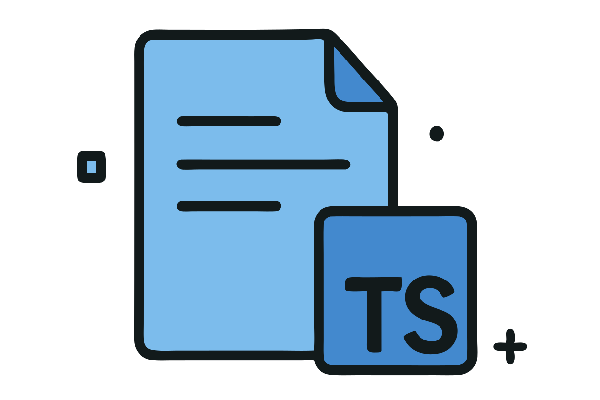

<div align="center">

<h1>Fetch Result Please!</h1>

<h3><code>const result = await fetchRP(api.$fetch())</code></h3>


</div>

# fetch-result-please 

[![npm version][npm-version-src]][npm-version-href]
[![npm downloads][npm-downloads-src]][npm-downloads-href]
[![Codecov][codecov-src]][codecov-href]
[![Bundlejs][bundlejs-src]][bundlejs-href]
[![TypeDoc][TypeDoc-src]][TypeDoc-href]

* [fetch-result-please ](#fetch-result-please-)
  * [Overview](#overview)
  * [Features](#features)
  * [Usage](#usage)
    * [Install package](#install-package)
    * [Import and use](#import-and-use)
  * [Credits](#credits)
  * [License](#license)

## Overview

**fetch-result-please** helps you get a consumable result from a fetch call with a helper, and a few other features :) (feel free to raise requests).

Note: `fetch-result-please` focuses on being a minimal, helper function that you can just add-in to your existing fetch calls, if you're building things from scratch, it is recommended that you check out and use a proper custom fetch implementation like [`ofetch`](https://github.com/unjs/ofetch), [`ky`](https://github.com/sindresorhus/ky), [`up-fetch`](https://github.com/L-Blondy/up-fetch), etc.

## Features

+ 👌 Smartly parses and return the consumable result from a fetch `Response`.
+ 🧐 *Submit your feature requests, I'll take a look if it fits the scope*

## Usage

### Install package

```sh
# npm
npm install fetch-result-please

# bun
bun add fetch-result-please

# pnpm
pnpm install fetch-result-please
```

### Import and use

```ts
// ESM
import { fetchRP } from 'fetch-result-please'

const fetchTodo = () => fetch('https://jsonplaceholder.typicode.com/todos/1')

const result: { id: number } = await fetchRP(fetchTodo())

// To force a specific response type, pass in `detectResponseType`:
const blobResult: Blob = await fetchRP(fetchTodo(), { detectResponseType: () => 'blob' })
```

## Credits

Codes are borrowed from [unjs/ofetch](https://github.com/unjs/ofetch), I highly recommend you to try use it first if it's viable for your usecase, `fetch-result-please` focuses more to enhance your existing fetch calls fast, especially in cases where it's wonky or not possible to use a custom fetch implementation directly.

## License

[![License][license-src]][license-href]

<!-- Badges -->

[npm-version-src]: https://img.shields.io/npm/v/fetch-result-please?labelColor=18181B&color=F0DB4F
[npm-version-href]: https://npmjs.com/package/fetch-result-please
[npm-downloads-src]: https://img.shields.io/npm/dm/fetch-result-please?labelColor=18181B&color=F0DB4F
[npm-downloads-href]: https://npmjs.com/package/fetch-result-please
[codecov-src]: https://img.shields.io/codecov/c/gh/namesmt/fetch-result-please/main?labelColor=18181B&color=F0DB4F
[codecov-href]: https://codecov.io/gh/namesmt/fetch-result-please
[license-src]: https://img.shields.io/github/license/namesmt/fetch-result-please.svg?labelColor=18181B&color=F0DB4F
[license-href]: https://github.com/namesmt/fetch-result-please/blob/main/LICENSE
[bundlejs-src]: https://img.shields.io/bundlejs/size/fetch-result-please?labelColor=18181B&color=F0DB4F
[bundlejs-href]: https://bundlejs.com/?q=fetch-result-please
[jsDocs-src]: https://img.shields.io/badge/Check_out-jsDocs.io---?labelColor=18181B&color=F0DB4F
[jsDocs-href]: https://www.jsdocs.io/package/fetch-result-please
[TypeDoc-src]: https://img.shields.io/badge/Check_out-TypeDoc---?labelColor=18181B&color=F0DB4F
[TypeDoc-href]: https://namesmt.github.io/fetch-result-please/
